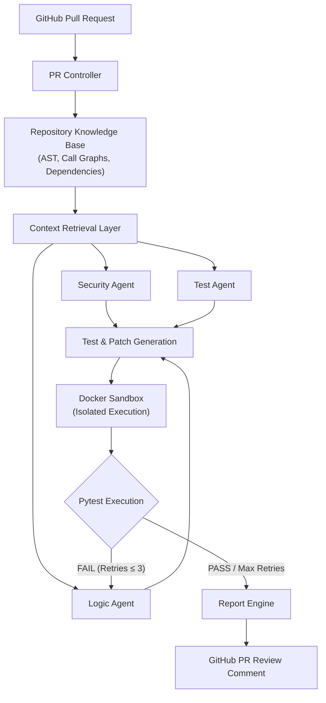

# 🛡️ PatchProof
### **AI-Powered Automated Pull Request Verification & Code Review System**

---

## 📌 Overview

**PatchProof** is an automated code review and verification system integrated with GitHub Pull Requests. 

Unlike traditional AI review tools that only provide static suggestions, PatchProof **verifies AI-generated findings and candidate patches through actual execution in an isolated Docker sandbox**. It compares PR test execution against the repository's base commit to detect regressions and ensures only tested, reliable code changes are presented to developers.

---

## 🏛️ System Architecture

---

## ⚡ Core Features

- 🔍 **Repository-Aware Analysis**: Indexes ASTs, symbol hierarchies, call graphs, and tests to understand code changes in context.
- 🤖 **Specialized Multi-Agent Review**:
  - **Security Agent**: Scans for vulnerabilities, authentication issues, and unsafe inputs.
  - **Logic Agent**: Detects behavioral bugs and generates candidate fix patches.
  - **Test Agent**: Identifies coverage gaps and generates reproducible test cases.
- 📦 **Isolated Docker Sandbox**: Safely executes candidate patches and tests with strict timeouts and memory limits.
- ⚖️ **Baseline Regression Detection**: Compares test suite results between the base commit and PR commit to identify newly introduced regressions.
- 🔁 **Bounded Self-Repair Loop**: Automatically refines failing patches up to 3 times before final reporting.
- 💬 **Evidence-Based PR Feedback**: Posts clear, execution-backed verification reports directly to GitHub PRs.

---

## 💻 Tech Stack

- **Language**: Python 3.11+
- **Backend API**: FastAPI + Uvicorn
- **AI Orchestration**: LangGraph
- **LLM API**: OpenAI API (or compatible provider)
- **Code Analysis**: Python Native AST (`ast`, `asttokens`)
- **Testing Framework**: pytest
- **Sandbox Environment**: Docker Engine
- **Database**: SQLite with SQLAlchemy
- **Dashboard**: Streamlit
- **VCS Integration**: GitHub REST API & Webhooks

---

## 👥 Team

**Project Team ID**: `MP2026CSE83`  
**Institution**: Graphic Era Deemed to be University, Dehradun, India  
**Department**: Computer Science & Engineering  

- **Sahil Sharma** (GE-232023583)
- **Ashirwad Kumar** (GE-232023737)
- **Priyanshu Bisht** (GE-232023534)

**Project Guide**:
- **Prof. (Dr.) Akansha Gupta**, Department of Computer Science & Engineering
